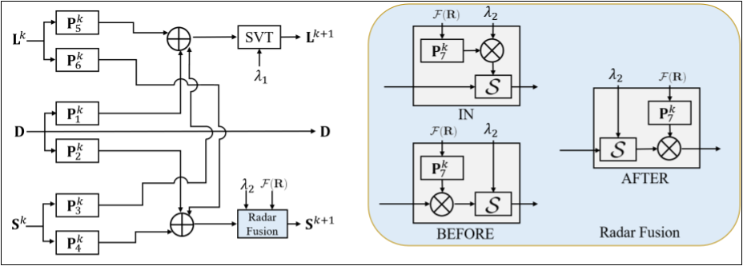

# radar-rgb-bfs
This repository provides the codes for the paper "Multimodal Unrolled Robust PCA for Background Foreground Separation" by Spencer Markowitz, Corey Snyder, Yonina C. Eldar, and Minh N. Do.



If you find this repository useful, please consider citing the following work:
```bibtex
@ARTICLE{9772940,
  author={Markowitz, Spencer and Snyder, Corey and Eldar, Yonina C. and Do, Minh N.},
  journal={IEEE Transactions on Image Processing},
  title={Multimodal Unrolled Robust PCA for Background Foreground Separation},
  year={2022},
  volume={31},
  number={},
  pages={3553-3564},
  doi={10.1109/TIP.2022.3172851}}
```

# Using this repository

## Setup
The required packages to use this repository are included in the ``requirements.txt`` file. These packages may be installed using pip as follows:

```
pip install -r requirements.txt
```

The training data necessary to train and test each algorithm is available at [this Google Drive link](https://drive.google.com/file/d/1VeJAp6yE7Bjo1dmvL4ZrXkKvusLjZP-O/view?usp=sharing) (~2.4 GB). Download the ``traindata.zip`` file and extract to the top-level directory of this repository, i.e. alongside the ``imagedata`` directory.

## Scene names
Our codebase refers to three scenes called ``CSL_lobby_700``, ``CSL_lobby_side_0``, and ``CSL_pantry``. These scenes correspond to scenes A, B, and C from the paper as follows:

``CSL_lobby_side_0``: Scene A

``CSL_lobby_700``: Scene B

``CSL_pantry``: Scene C

## Training examples
Running the training codes for the RUSTIC, CORONA, and U-Net models is quite similar between each model. For clarity, we provide a brief explanation on running each algorithm

### RUSTIC
To run our RUSTIC model, navigate to the ``NN/radar`` directory. You may establish the necessary experimental parameters in the ``setup.yaml`` file including model variant ('in', 'before', or 'after'), learning rate, number of layers, training scene, evaluation scene, and more. The YAML file provides brief comments for each parameter. Once you have your YAML file set, you may perform a training run with the following command:

```
CUDA_VISIBLE_DEVICES=X python3 train.py -yaml setup.yaml
```

You may set the visible device(s) however you see fit where we place the "X" above. Logging will be placed in the ``runs`` directory within ``NN/radar`` if you would like to visualize training in Tensorboard as well.

### CORONA
Running the CORONA model is effectively identical to our RUSTIC model except you should work within the ``NN/baseline`` directory. Update the ``setup.yaml`` file within and again use the following command:

```
CUDA_VISIBLE_DEVICES=X python3 train.py -yaml setup.yaml
```

### U-Net
To train a U-Net model, navigate to ``NN/unet/baseline``. Again, update the ``setup.yaml`` as you wish then start a training run with:

```
CUDA_VISIBLE_DEVICES=X python3 train.py -yaml setup.yaml
```

### ``run_multi.py``
We also provide codes to generate YAML files for multiple experimental runs with different seeds. To do so, you may run the file ``make_yamls`` within the ``NN`` directory. You will specify a template YAML file, a destination directory, and the number of files you would like. This will generate that number of YAML files counting up from zero for the seed number. To run these several training runs in either the ``NN/radar`` or ``NN/baseline`` directories, you may use the following command:

```
python3 run_multi.py -device <GPU device number> -dir <path to directory with YAML files>
```

## Evaluation
The evaluation codes for the RUSTIC and CORONA models are identical while they will be slightly different for the U-net model.

### RUSTIC and CORONA
Note that the following instructions will evaluate all models within each respective ``runs`` directory (or a different directory you specify) for the RUSTIC and CORONA models. This is handy for aggregating the results from multiple trials with different seeds, e.g. if you used the ``run_multi.py`` version of the training codes. If you would like to evaluate a single run, you may edit the ``test.yaml`` file and run ``test.py``.

Otherwise, we will edit the ``test_runs_setup.yaml`` file. Here, you specify the scene data you would like to evaluate on. Refer to the above table for which scene directories correspond to scenes A, B, and C respectively in the paper. Finally, you may evaluate your models using the command:

```
CUDA_VISIBLE_DEVICES=X python3 test_runs.py -yaml test_runs_setup.yaml
```

Note that it is not necessary to use a GPU for evaluation. This evaluation code will return the F-measure at various foreground thresholds and the AUC for the given model(s). The F-measure and AUC are reported with the standard deviation across runs in the ``runs_dir`` parameter.

### U-Net

To evaluate a U-Net model, edit the ``test.yaml`` file within ``NN/unet/baseline``. Set the run directory and model file name appropriately along with the paths to the scene data you would like to evaluate on. Finally, run the following command to compute evaluation metrics:

```
CUDA_VISIBLE_DEVICES=X python3 test.py -yaml test.yaml
```
